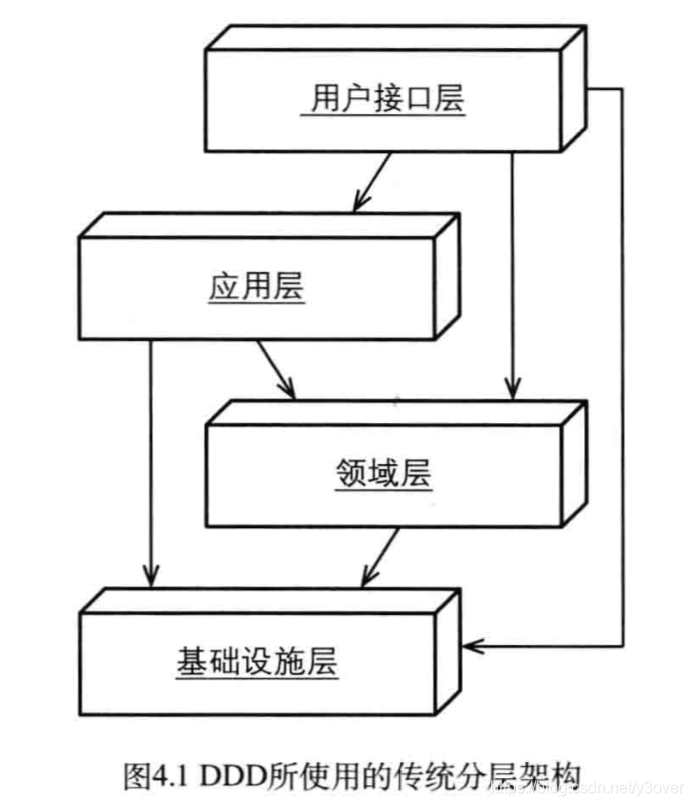
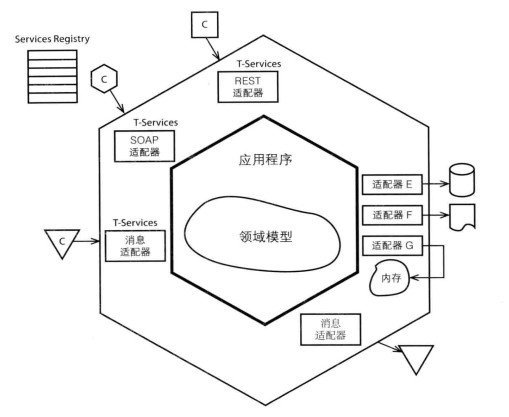
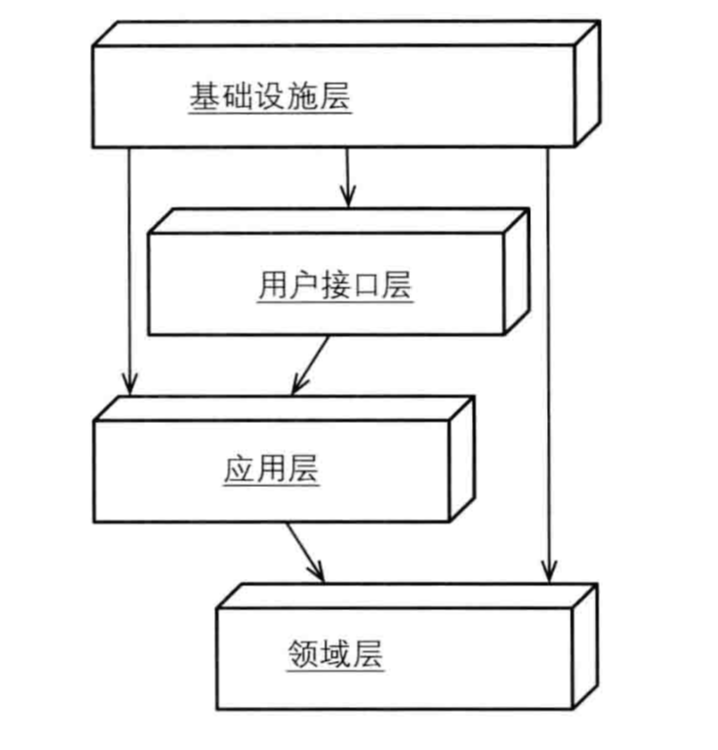
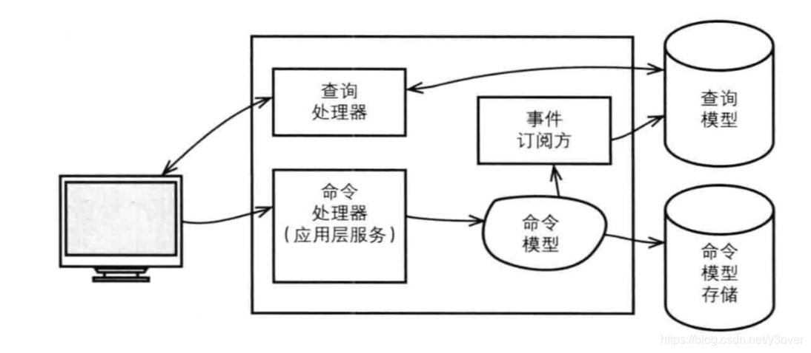
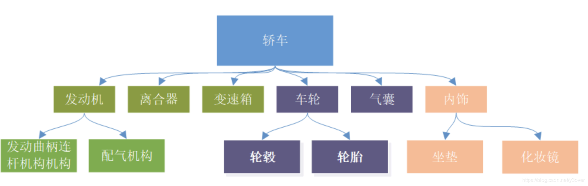
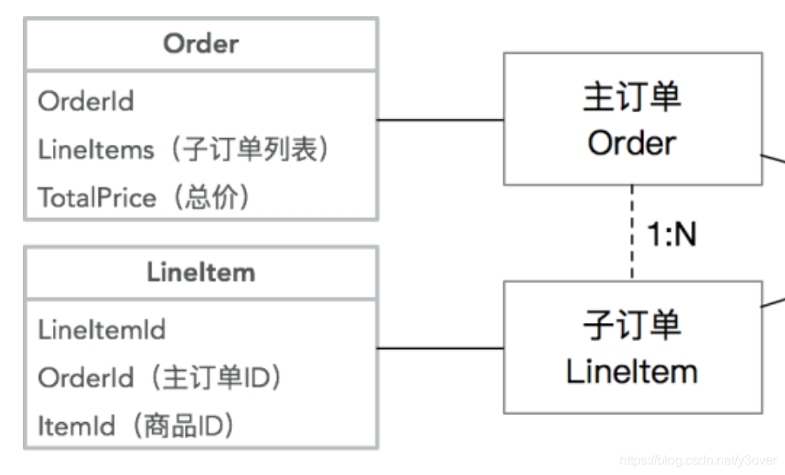

## 层级划分

针对DDD的层级架构<br>



| 对应层级 | 包名 |
| -----| ----|
| 接口层 |com.moyao.demo.interfaces|
| 应用层 |com.moyao.demo.application|
| 领域层 |com.moyao.demo.domain|
| 基础设施层|com.moyao.demo.infra|

## 模块划分
参考 "输入" - "处理" - "输出" 六边形架构 <br>


| 对应模块 | 包名 |说明|
| -----| ----| ----|
| 打包模块 |demo-app-boot|负责打包,环境隔离|
| 外部依赖 |demo-app-dependon|为了模拟外部rpc的包，可舍弃|
| 基础设施提供接口 |demo-app-infra|其它层要求基础层提供的服务|
| jdbc基础设施层|demo-infra-jdbc|提供jdbc基础服务|
| rpc基础设施层|demo-infra-rpc|提供外部依赖基础服务|
| 核心模块|demo-application|包括"应用层&领域层"两方面|
| rpc接口层|demo-interfaces-rpc|提供对外rpc接口|
| web接口层|demo-interfaces-web|提供对外web接口|

## 依赖倒层

根据架构图所描述的，基础设施层应向应用层，领域层提供服务。提供什么样的服务取决于应用层，领域层<br>



demo-app-infra模块则表示向基础设施层，索要的服务

## CQRS
以读写分离为主要思路的CQRS模型

> - 不排除简单读走领域
> - 不排除高并发写场景，直接service
> - CQ场景可具体情况具体考虑。

```
    // 转帐业务直接走领域
    @PostMapping("/transfer")
    public Result transfer(@RequestBody TransferCommand cmd) throws DailyLimitExceededException {
        cmd.setSourceUserId(UserHolder.get());
        Boolean result = transferService.transfer(cmd);
        return result? Result.success() : Result.fail();
    }
    // 用户查询直接普通service或者dao直接来
    @GetMapping("/user")
    public Result getUser() {
        Long id = UserHolder.get();
        UsersDo usersDo = userDao.selectById(id);
        Preconditions.checkNotNull(usersDo);
        LoginUserVo loginUserVo = UserConverter.CONVERTER.toLoginUserVo(usersDo);
        return Result.success(loginUserVo);
    }
```

## DDD领域
理解DDD，我们要先理解什么是领域
> 领域是有范围的，我们能够根据领域范围的不同来定义界限，定义边界

   我们举个例子，比如我们要研究轿车，首先我们先确定**领域为轿车**，再把“轿车”如下图拆解
 
如图我们拆分 发动机、离合器、变速箱、车轮、气囊、内饰，这些是轿车的**子域**
>一个领域是由一个或者多个子域构成的,子域还可以再进行拆分，也就是**子子域.** 

根据子域不同功能属性和重要性，将领域分为
- 核心域
  指的是这个业务的核心功能，核心模块。比如，轿车主打的是动力充沛的话，那么发动机一定是核心域，比如说主打的是操控的话，那么变速箱、离合器一定是核心域。
- 通用域
  没有太定制化功能， 对于汽车来说我们可以把内饰理解为通用域，因为比如说坐垫，化妆镜，这类不一定是只能给某一辆单独型号的车来使用的东西，所以具有一些通用的属性。对于系统来说的话，通用域则是你需要用到的通用系统，比如认证、权限等等
- 支撑域
  处于通用和核心之间。功能较通用，但是要定制。以汽车为例，我们可以把车轮和气囊作为支撑域来看待，因为对于车轮和气囊来说，它们的大小尺寸是严格和车辆保持一致的，也就是说不具备通用性，是极具有车厂风采的个性化产品
  
确定了域后定位后，继续向下细分。比如“发动机” 拆成 “发动曲柄栏杆机构” 和“配气机构”，“配气机构” 再拆成 “气门组”和“气门传动组”。一直可拆分到进气门、排气门、气门导管、气门座及气门弹簧等零件。
>那么这些零件就对应着聚合根、实体、值对象

#### 值对象Domain Primitive（DP）
不从任何其他事物发展而来，初级的形成或生长的早期阶段。类比Java中的 Integer、String对象都是从byte[]引变过来成为基础对象。在领域中，我们也会创造一些基础对象PhoneNumber，Name，Address。

```java
public class PhoneNumber {
  
    private final String number;
    public String getNumber() {
        return number;
    }
 
    public PhoneNumber(String number) {
        if (number == null) {
            throw new ValidationException("number不能为空");
        } else if (isValid(number)) {
            throw new ValidationException("number格式错误");
        }
        this.number = number;
    }
 
    public String getAreaCode() {
        for (int i = 0; i < number.length(); i++) {
            String prefix = number.substring(0, i);
            if (isAreaCode(prefix)) {
                return prefix;
            }
        }
        return null;
    }
 
    private static boolean isAreaCode(String prefix) {
        String[] areas = new String[]{"0571", "021", "010"};
        return Arrays.asList(areas).contains(prefix);
    }
 
    public static boolean isValid(String number) {
        String pattern = "^0?[1-9]{2,3}-?\\d{8}$";
        return number.matches(pattern);
    } 
}
```
从技术角度讲，他们都是String.但这么一包装则成为领域不可拆分的值。

#### 实体 entity
实体是一个**唯一**的东西。并且可以持续地**变化**。它和值对象的区分点是唯一身份标识和可变性。

```java
/**
 *  用户帐号实体
 */
@Data
public class Account {

    private AccountId id;
    private AccountNumber accountNumber;
    private UserId userId;
    private Money available;
    private Money dailyLimit;
    private Currency currency;

    /**
     * 转出操作，因为此方法只改变Account的值，所以写在方法内
     * @param money 转出金额
     */
    public void withdraw(Money money) throws InvalidCurrencyException, DailyLimitExceededException {
        if (this.available.compareTo(money) < 0){
            throw new InsufficientFundsException();
        }

        if (this.dailyLimit.compareTo(money) < 0){
            throw new DailyLimitExceededException();
        }

        if (!this.getCurrency().equals(money.getCurrency())){
            throw new InvalidCurrencyException();
        }
        this.available = this.available.subtract(money);
    }

    // 转入
    public void deposit(Money money) throws InvalidCurrencyException {
       if (!this.getCurrency().equals(money.getCurrency())){
           throw new InvalidCurrencyException();
       }

       this.available = this.available.add(money);

    }
}
```
1. 实体对象的成员用值对象描述
2. 实体对象有唯一性标识AccountId
3. 实体具有可变性，提供withdraw(转出)和deposit(转入)两大方法

#### 聚合根 Aggregate
生活中存在一些实体不仅仅由值对象形成，他不可以由其它entity组成。我们把此类实体称为聚合根。以订单为例子

#### 领域服务 Domain Service
领域服务主要提供此领域的相关操作，此操作不属于实体和值对象，主要特性如下
1. 执行一个显著的业务操作过程
2. 对领域对象进行转换
3. 以多个领域对象作为输入进行计算（重要）

```java
public class AccountTransferDmServiceImpl implements AccountTransferDmService {

    /**
     *  两帐户相互汇款，涉及两entity的变动，所以放在domainService处理
     *  domainService方法同entity方法一样，只算对象状态的变化，不写外界交互
     *  domainService只是对entity方法的补足
     */
    @Override
    public void transfer(Account sourceAccount, Account targetAccount, Money targetMoney, ExchangeRate exchangeRate) throws  DailyLimitExceededException {
        Money sourceMoney =  exchangeRate.exchageTo(targetMoney);
        sourceAccount.withdraw(sourceMoney);
        targetAccount.deposit(targetMoney);
    }
}
```

#### 领域管理
领域实体的创建主要分为以下二种情况：
1. Repository,从数据库获取与存储

```java
public class AccountRepositoryImpl implements AccountRepository {
    @Autowired
    private AccountMapper accountDAO;

    @Autowired
    private AccountBuilder accountBuilder;

    @Override
    public Account find(AccountId id) throws Exception {
        AccountDO accountDO = accountDAO.selectById(id.getValue());
        return accountBuilder.toAccount(accountDO);
    }

    @Override
    public Account find(AccountNumber accountNumber) throws Exception {
        AccountDO accountDO = accountDAO.selectByAccountNumber(accountNumber.getValue());
        if (accountDO == null){
            throw new BusinessException(String.format("账户[%s]不存在", accountNumber.getValue()));
        }
        return accountBuilder.toAccount(accountDO);
    }

    @Override
    public Account find(UserId userId) throws Exception {
        AccountDO accountDO = accountDAO.selectByUserId(userId.getId());
        if (accountDO == null){
            throw new BusinessException("账户不存在");
        }
        return accountBuilder.toAccount(accountDO);
    }

    @Override
    public Account save(Account account) throws Exception {
        AccountDO accountDO = accountBuilder.fromAccount(account);
        if (accountDO.getId() == null) {
            accountDAO.insert(accountDO);
        } else {
            accountDAO.update(accountDO);
        }
        return accountBuilder.toAccount(accountDO);
    }
}
```
2. factory/converter 根据外部参数，内存中创建

```java
public interface ExchangeRateConverter {

    ExchangeRateConverter CONVERTER = Mappers.getMapper(ExchangeRateConverter.class);

    default ExchangeRate toExchangeRate(ExchangeRateEo exchangeRateEo){
        return new ExchangeRate(exchangeRateEo.getRage(),
                new Currency(exchangeRateEo.getSourceCurrency()),
                        new Currency(exchangeRateEo.getTargetCurrency()));
    }
}
```

#### 界限上下文
串连起外部依赖与领域模型

```java
public class TransferServiceImpl implements TransferService {

    //    private AuditMessageProducer auditMessageProducer;
    private final ExchangeRateExService exchangeRateExService;

    private final AccountTransferDmService accountTransferDmService;

    private final AccountRepository accountRepository;

    @Transactional
    @Override
    public Boolean transfer(TransferCommand transferCommand) throws DailyLimitExceededException {
        Money targetMoney = new Money(transferCommand.getTargetAmount(), new Currency(transferCommand.getTargetCurrency()));

        Account sourceAccount = accountRepository.find(new UserId(transferCommand.getSourceUserId()));
        Account targetAccount = accountRepository.find(new AccountNumber(transferCommand.getTargetAccountNumber()));

        // 通过Converter将外部的转为domain valueobject
        ExchangeRateEo exchangeRateEo = exchangeRateExService.getExchangeRate(sourceAccount.getCurrency().getValue(), targetMoney.getCurrency().getValue());
        ExchangeRate exchangeRate = ExchangeRateConverter.CONVERTER.toExchangeRate(exchangeRateEo);

        accountTransferDmService.transfer(sourceAccount, targetAccount, targetMoney, exchangeRate);

        accountRepository.save(sourceAccount);
        accountRepository.save(targetAccount);
        //
        //        // 发送审计消息
        //        AuditMessage message = new AuditMessage(sourceAccount, targetAccount, targetMoney);
        //        auditMessageProducer.send(message);
        return true;
    }
}
```
1. 从TransferCommand获取参数
2. 根据参数使用accountRepository调用相应领域实体
3. 根据外部接口获取领域ExchangeRate
4. 使用领域服务accountTransferDmService处理转帐业务
5. 调用accountRepository存储实体


## 快速开始

1. 新建表结构

```sql
CREATE TABLE `users` (
  `id` bigint(20) NOT NULL AUTO_INCREMENT,
  `username` varchar(128) NOT NULL,
  `currency` varchar(10) DEFAULT NULL,
  `available` decimal(10,2) DEFAULT NULL,
  `daily_limit` decimal(10,2) DEFAULT NULL,
  `created` datetime NOT NULL,
  `modified` datetime NOT NULL,
  PRIMARY KEY (`id`),
  UNIQUE KEY `uk_user_muid_un` (`username`)
) ENGINE=InnoDB COMMENT='用户表'


CREATE TABLE `trade_detail` (
  `id` bigint(20) NOT NULL AUTO_INCREMENT,
  `tid` varchar(40) NOT NULL ,
  `shop_id` bigint(20) NOT NULL,
  `created` datetime NOT NULL ,
  `modified` datetime NOT NULL ,
  PRIMARY KEY (`id`)
) ENGINE=InnoDB  COMMENT='订单详情'
```
2. 安装zookeeper
3. 启动外部依赖DependApplication

## 具体落地步骤

DDD方案从技术角度是好分析，但落地有点难度

1. 领域过界如果划分
2. 领域和领域如何交互Context Map
3. 值对象如何定义
4. 如果与现有的开发流程结合起来

> - 在产品评审阶段，让产品把业务术语梳理好
> - 技术方案制定阶段 先跟架构师和产品  把context map和边界划分
> - 技术方案制定阶段 技术人员 再拆分聚合根和实体，找出所有得值对象
> - 测试用例评审阶段 主要把领域中的用例和测试用例对比一下
> - codeReview阶段 主要查看 实体 值对象有没有被破坏
> - 测试阶段  无变化
> - 发布阶段  无变化

## 主要参考
- 《实现领域驱动设计》
- 《[领域驱动设计中的子域、核心域、通用域、支撑域](https://blog.csdn.net/qq_34370153/article/details/104202176)》
- 《[DDD 系列- Domain Primitive](https://blog.csdn.net/Taobaojishu/article/details/100425428)》
- 《[DDD系列 第二弹 - 应用架构](https://blog.csdn.net/Taobaojishu/article/details/101444324)》
- 《[DDD系列 第三讲 - Repository模式](https://blog.csdn.net/Taobaojishu/article/details/106152641)》
- 《[DDD系列第四讲：领域层设计规范](https://blog.csdn.net/Taobaojishu/article/details/111878209)》
- 《[DDD系列第五讲：聊聊如何避免写流水账代码](https://blog.csdn.net/Taobaojishu/article/details/115911833)》
- 《[ddd-demo](https://github.com/gaotingwang/ddd-demo)》
- 《[dddbook](https://github.com/Air433/dddbook)》